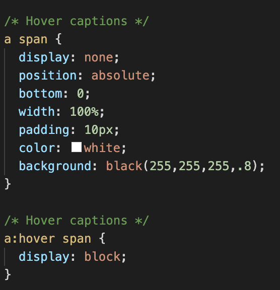
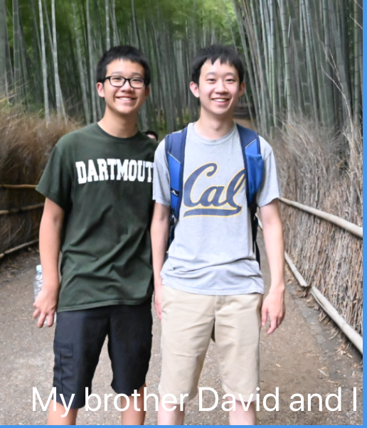

My personal website can be found at brianwang.me

## Overview
This website is built with React and CSS. I started building this website as a part of the DALI mini web development course I was a part of during this term. I kept improving on the site as I learned more through the course and eventually deployed this website to github pages. I have further developed this website in recent days to match the guidelines of the Basic Webpage Challenge for my DALI Lab Application. Hope you enjoy! Be on the look out for more improvements on this site as I learn more about design and React.

### Notable Features

**Project Timeline**

I implemented React's Vertical Timeline Component and used it to build a timeline of all the development projects I've worked on. 

**Hover Captions** 

I also implemented hover captions in the "Random Things" part of my page. To do this, I had to write special CSS code to only display captions when a user hovered over a picture. Below is the CSS: 

Below is an example of one of these hover captions: 

### Future Improvements

As I learn more React/CSS, I hope to improve the design of this site and make it more interactive. I also hope to add more information in the future. 

