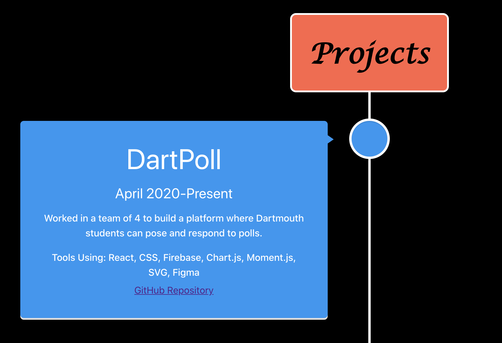

My personal website can be found at brianwang.me

## Overview
This website is built with React and CSS. I started building this website as a part of the DALI mini web development course I was a part of during this term. I kept improving on the site as I learned more through the course and eventually deployed this website to github pages. I have further developed this website in recent days to match the guidelines of the Basic Webpage Challenge for my DALI Lab Application. Hope you enjoy! Be on the look out for more improvements on this site as I learn more about design and React.

